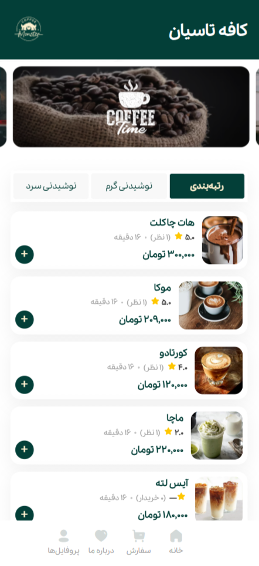
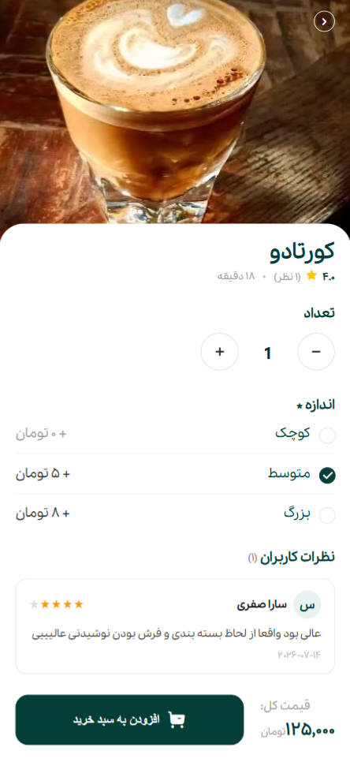
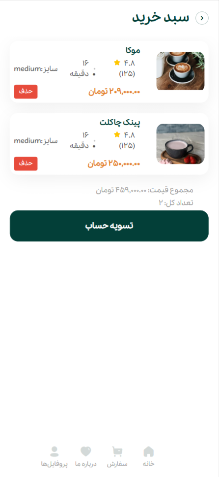
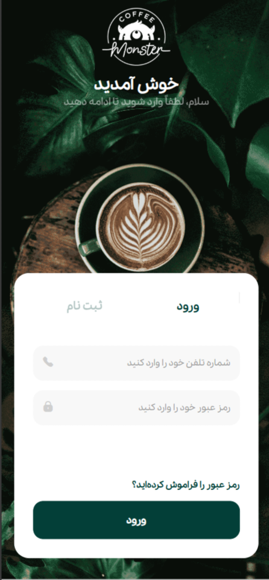
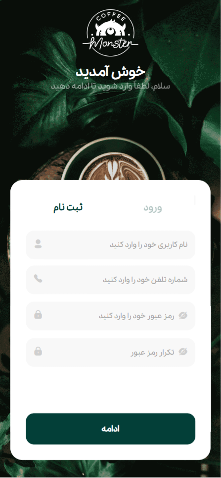
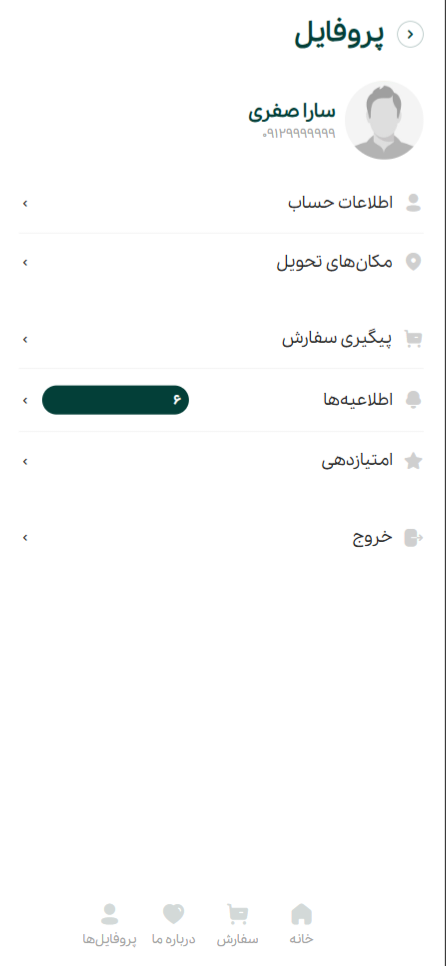
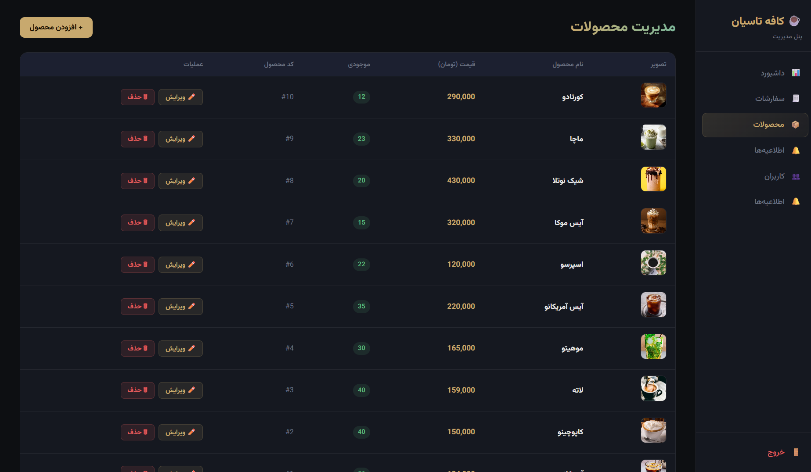

# ☕ Cafe Tasian

A modern coffee shop web application built with **PHP**, **MySQL**, **HTML**, **CSS**, and **JavaScript**.

---

## 📌 About the Project

Cafe Tasian is a full-stack coffee shop website where users can browse products, create an account, log in, manage their shopping cart, and place orders.

The project also includes an **Admin Panel** for managing products and website content.

This project was developed as a personal portfolio project to improve my back-end development skills using PHP and MySQL.

---

## ✨ Features

- 🔐 User Authentication (Register & Login)
- 👤 User Profile Management
- ☕ Browse Coffee Products
- 🔍 Product Details
- 🛒 Shopping Cart
- 📦 Order Management
- ⭐ Product Reviews
- 🔎 Search Products
- ⚙️ Admin Dashboard
- 📝 Product Management
- 💾 MySQL Database Integration

---

## 🛠️ Technologies Used

- PHP
- MySQL
- HTML5
- CSS3
- JavaScript
- Bootstrap

---

## 📸 Screenshots

### Home Page and Products



---


### Product Details



---

### Shopping Cart



---

### Login



---

### Register



---

### User Profile



---


### Admin Dashboard


---

### Product Management



---

## ⚙️ Installation

Clone the repository:

```bash
git clone https://github.com/NazaninSafari/Cafe-Tasian.git
```

Move the project to your **XAMPP htdocs** directory.

Create a MySQL database.

Import the SQL file into **phpMyAdmin**.

Update your database credentials inside the configuration file.

Start **Apache** and **MySQL**.

Open your browser and visit:

```
http://localhost/Cafe-Tasian
```

---

## 📂 Project Structure

```
Cafe-Tasian/
│
├── admin/
├── css/
├── fonts/
├── images/
├── js/
├── Photos/
├── index.php
├── config.php
└── README.md
```

---

## 🚀 Future Improvements

- 💳 Online Payment Gateway
- ❤️ Wishlist
- 🏷️ Product Categories
- 📱 Responsive UI Improvements
- 🔒 Enhanced Security
- 🚚 Order Tracking

---

## 👩‍💻 Author

**Nazanin Safari**

GitHub:
https://github.com/NazaninSafari

---

## ⭐ Support

If you found this project helpful, please consider giving it a ⭐ on GitHub.
